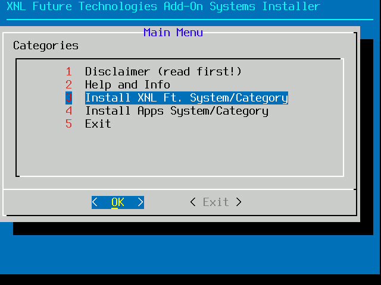

# XNL R36 Add-On Systems Installer
With this simple program (script) you can install additional systems into your R36S/R36H's main menu (into EmulationStation).  
  
Current Add-On Systems supported by this program:  
<strong>- XNL Ft.</strong>  
<strong>- Apps</strong>  

  
# Add-on System Explanations
<strong>XNL Ft.</strong>  
This category/system is intended to be used with all the packages, programs and tools I've published (and are currently working on). You <strong>can</strong> also just copy most (if not all) of my releases into the /roms/tools/XNL Tools folder on your SD-Card, but using this category/system instead just keeps it a lot more organized. Of course you don't have to use it, I/we personally do like to have a more organized system to use my/our tools instead of cluttering the Options/System options/folders 😊.  
<strong>IMPORTANT NOTE:</strong> It is NOT recommended to add your own scripts/tools to this category/system, because some releases will actually remove and/or overwrite certain files which you might place in this folder/system when using it. If you want to be able to install/use your own scripts/programs, then the next Category is perfectly suited for that purpose😊  
<strong>File Extensions:</strong> .sh  
  
<strong>XNL Ft.</strong>  
In this system you can basically put all the additional applications (or scripts) with an .sh extension. Some of my programs which can be installed with the XNL Package Manager will be using this category/system, but you can also just install/copy your own or third party .sh scripts into this folder so you can run them from your R36S/R36H.  
<strong>File Extensions:</strong> .sh  
  
# Installation
The file XNL Add-On Systems.sh <strong>needs</strong> to be copied to /roms/tools. You DO NOT need to copy the themes folder into this folder. The explanation on how to use the themes files/folders is explained bellow😊. This program will not allow to be run from one of the systems/categories it can install. This to prevent that you accidentally uninstall the system in which this program is located, and thus making it impossible to reactivate it again 😉.  
  
# Theme Support
Is there theme support for these add-on systems? Yes, but <strong>very limited</strong>. I have included some theme files in the Themes folder, you can basically just copy all the folders from the folder Themes into your /roms/themes folder and then the themes which are (currently) in the Themes folder (in this repository) will automatically show the correct image/theme style for my add-on categories.  
  
I will however <strong>NOT</strong> add support for all kinds of themes which are out there. It is quite easy (for most theme though that is), to add your own custom icons/theme style for a new system to it. <strong>most of the time</strong> it's just a matter of creating an additional .png, .jpg or .svg file. the internal names of my current system(s) are: <strong>xnlft</strong>, <strong>apps</strong>  
  
<strong>Q: Can you please add support/files for [Insert Theme Name Here]?</strong>
A: No sorry, I just won't. It's not that I can't, but if I would agree with those requests, then my "issues/support tickets" will soon flood with all kinds of themes which people want to see to be added. I just don't have the time for that. Please just add/make the files yourself for your theme if it's not supported/included, or ask your theme creator to include them in a future update (if possible). IF you have made custom theme layout for my Add-on systems, and would like to see them added, just make a pull request and I will see if I can merge them. NOTE: It might be that I will alter the icons/theme/logo to make sure they properly reflect <strong>my</strong> intentions of these Add-on Systems if you make a pull-request.  
  
<strong>Q: Why don't you just make the theme installation automated for the supported themes?</strong>  
A: Good question, and I have even thought of that for a while, but that will also introduce the risk of those 'auto installers' breaking when the theme creator/developer changes the structure of his/her theme. It introduces issues where I would have to check if the themes already have existing files/logos for things like apps.png for example, to prevent that my installer would accidentally 'mess-up' someones theme etc.. Sorry that would be "a lot" of programming and checking (if done properly!) for something as simple where you could just 'copy-paste' a single folder and then you decide if you would for example want to overwrite a file apps.png (if it already exists).😊  

</strong>NOTE FOR XNL INSIDER PROGRAM MEMBERS:</strong>  
If you are using the XNL Ft. interface and/or the XNL ARCADE STATION Theme, then you do not need to copy <strong>any</strong> of the files or folders from the themes folder. Our system(s) already have full theme support for these Add-On systems.  
  
# Use At Your Own Risk
Considering that this program modifies the es_systems.cfg there is a <strong>slight</strong> chance that your EmulationStation won't start anymore IF something might go (extremely) wrong. I have tested this program countless of times now, which also includes installing one of my add-on systems, uninstalling it, re-installing it, over and over and over, and I had zero issues. HOWEVER, it might obviously happen that the internal structure of these configuration files (of EmulationStation) might change in the future, and thus causing this program to become incompatible and possibly 'breaking' the EmulationStation systems.cfg file.  
  
# Automatic Back-up Build-in
This program does however have an automatic backup build-in which backups the es_systems.cfg to: <strong>/roms/backup/XNL</strong>. This backup will have the current version of ArkOS appended to it so even if ArkOS updates the file for some reason, then my application will back-up the original file (again) when you (re-) run my Add-On Systems Installer.  

# I Have Other Questions Which Are Not Listed Here
No problem😊, just open <strong>XNL Add-On Systems.sh</strong> in a (decent) text editor like for example Notepad++, and you will see that the program/script is literally full of comments, additional information and more 😊.

